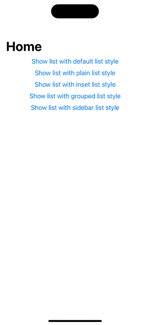

# SwiftUI `List` example

This SwiftUI application demonstrates how to display an array of items in a [List][1] such that the items in the [List][1] change their appearance when tapped or pressed down.

Here's a demo of the app running on an iPhone 15 Simulator:

[1]: https://developer.apple.com/documentation/swiftui/list
