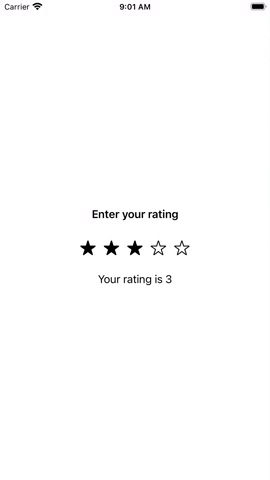

# SwiftUI custom rating view

This SwiftUI application demonstrates a custom rating view which looks and behaves as follows:

See the [ContentView](App4/ContentView.swift) and [App4UITests](App4UITests/App4UITests.swift) classes for the specifics.
