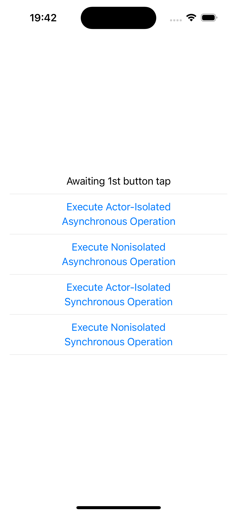

# SwiftUI asynchronous operation example

## About

This SwiftUI application demonstrates how to schedule synchronous and asynchronous work when a [Button][1] is tapped.

Refer to the four Buttons in the [ContentView][4] struct. Each Button calls into a function of a [MainActor][2] view model either directly or via a [Task][3]. Each of the functions in the view model is declared as `nonisolated` or `async` or neither or both.

When you run the app, you will see a user interface as follows:

## Further reading

1. [Should I declare a 'nonisolated' or 'async' function in my 'MainActor' view model for work that will run inside and outside of the MainActor context?][5]

[1]: https://developer.apple.com/documentation/swiftui/button
[2]: https://developer.apple.com/documentation/swift/mainactor
[3]: https://developer.apple.com/documentation/swift/task
[4]: App6/ContentView.swift
[5]: https://stackoverflow.com/questions/76886894
