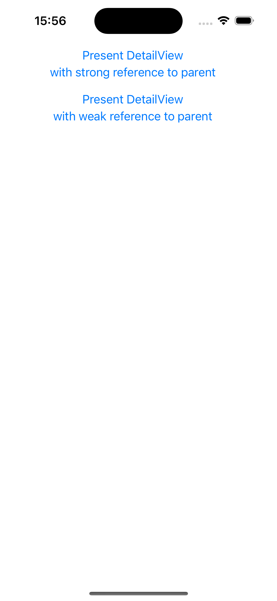

# UIViewController and SwiftUI view reference cycle example

## About

This UIKit application demonstrates how you can accidentally create a strong reference cycle between a [UIViewController][1] and a SwiftUI view if you're not paying attention.

A strong reference cycle in such a context is a problem because the parent view controller and the [UIHostingController][2] which is hosting the SwiftUI view will both stick around in memory even after the parent view controller has been dismissed.

See [DetailView1Controller][3] for the incorrect way to create a reference from a SwiftUI view to its parent view controller. See [DetailView2Controller][4] for the correct way to create a reference from a SwiftUI view to its parent view controller. 

When you run the app, you will see a user interface as follows:

[1]: https://developer.apple.com/documentation/uikit/uiviewcontroller
[2]: https://developer.apple.com/documentation/swiftui/uihostingcontroller
[3]: App8/DetailView1Controller.swift
[4]: App8/DetailView2Controller.swift
