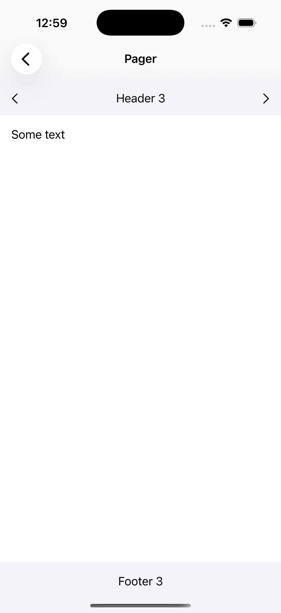
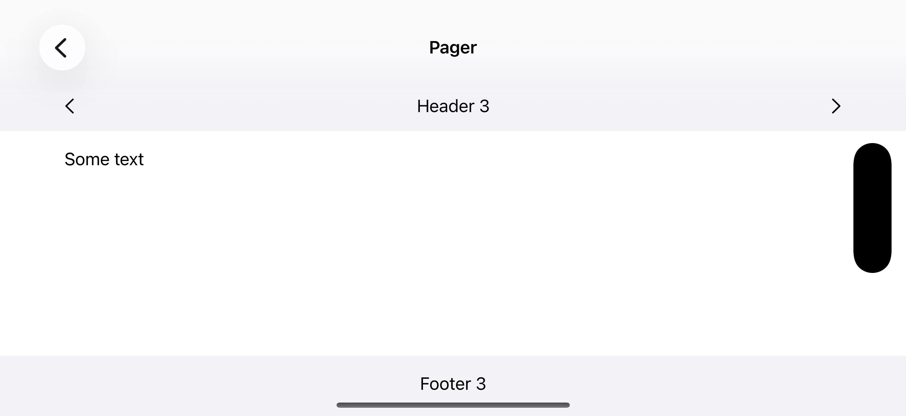

# SwiftUI edge-to-edge pager example

This SwiftUI application demonstrates how you can create a horizontal pager
which renders its pages edge-to-edge
whilst the pages themselves inset their content relative to the safe area.

The pager renders in portrait screen orientation as follows:

And renders in landscape screen orientation as follows:

